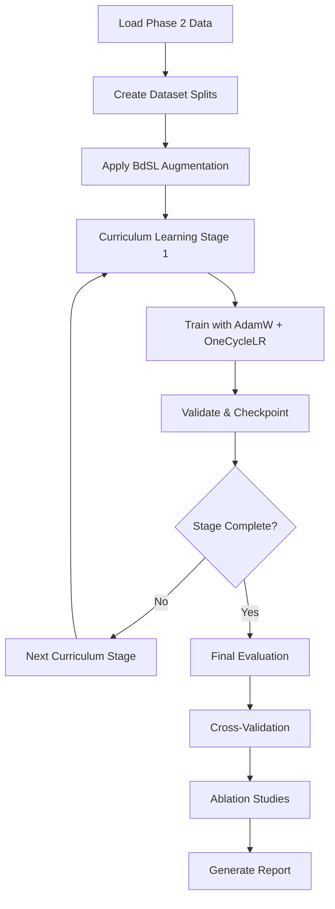

# How the BdSLW_SPOTER System Works

## Overview

This is a **Bengali Sign Language (BdSL) recognition system** using a **transformer-based architecture** called SPOTER (Sign Pose-based Transformer). It's designed to recognize 60 different Bengali sign words with high accuracy.

## System Architecture

```mermaid
graph TB
    A[Input Video] --> B[MediaPipe Pose Extraction]
    B --> C[108D Pose Features<br/>(54 landmarks x 2 coords)]
    C --> D[BdSL-Specific Normalization]
    D --> E[SPOTER Transformer]
    E --> F[Classification Head]
    F --> G[60 BdSL Word Classes]
    
    style E fill:#e1f5ff
    style G fill:#90EE90
```

## Phase-by-Phase Workflow

### **Phase 1-2: Data Preparation** (Completed)
- Extracts pose landmarks from videos using MediaPipe
- Normalizes poses with BdSL-specific adaptations
- Creates structured dataset with 9,307 videos across 60 classes

### **Phase 3: Model Architecture** ([`BdSL_SPOTER_Phase3.ipynb`](comparison%20model/BDSLW_SPOTER/BdSL_SPOTER_Phase3.ipynb))

**Core Components:**

1. **Positional Encoding** (Cell 4)
   - Adds temporal position information to pose sequences
   - Uses sinusoidal encoding for sequence ordering

2. **Multi-Head Attention** (Cell 5)
   - 9 attention heads for capturing different pose relationships
   - Scaled dot-product attention mechanism

3. **Transformer Encoder** (Cell 6)
   - 6 encoder layers (later optimized to 4)
   - Self-attention + feed-forward networks
   - Layer normalization and dropout

4. **Complete SPOTER Model** (Cell 7)
   ```python
   Input: [batch, seq_len, 108]  # Pose sequences
   ↓
   Linear Projection → 108D
   ↓
   + Positional Encoding
   ↓
   + Class Token
   ↓
   8× Transformer Encoder Layers
   ↓
   Class Token Extraction
   ↓
   Classification Head → 60 Classes
   ```

**BdSL-Specific Enhancements** (Cell 13):
- Cultural attention mechanism for Bengali signing nuances
- Signing space weights (85% width ratio)
- Enhanced classifier with GELU activation

### **Phase 4: Advanced Training** ([`BdSL_SPOTER_Phase4_RealData.ipynb`](comparison%20model/BDSLW_SPOTER/BdSL_SPOTER_Phase4_RealData.ipynb))

**Key Innovations:**

1. **Data Augmentation** (Cell 4)
   - Temporal scaling (0.8-1.2x speed variation)
   - Spatial noise for signer variation
   - Perspective transformation for camera angles
   - BdSL-specific hand position variance

2. **Curriculum Learning** (Cell 9)
   ```mermaid
   graph LR
       A[Stage 1<br/>Easy samples<br/>Short sequences] --> 
       B[Stage 2<br/>Medium difficulty] -->
       C[Stage 3<br/>Harder samples] -->
       D[Stage 4<br/>Full dataset]
   ```

3. **Production Model** (Cell 6)
   - 8 encoder layers (increased capacity)
   - Attention masking for variable sequence lengths
   - Learnable positional encodings
   - Advanced classification head

4. **Training Configuration** (Cell 7)
   - **Optimizer**: AdamW with OneCycleLR scheduler
   - **Learning Rate**: 3e-4 with warmup
   - **Regularization**: Label smoothing (0.1) + dropout (0.15)
   - **Gradient Accumulation**: 2 steps for effective batch size

### **Phase 5: Comprehensive Evaluation** ([`BdSL_SPOTER_Phase5_Evaluation.ipynb`](comparison%20model/BDSLW_SPOTER/BdSL_SPOTER_Phase5_Evaluation.ipynb))

**Evaluation Framework:**

1. **Advanced Metrics** (Cell 3)
   - Top-1/Top-5 accuracy
   - Precision, Recall, F1-Score (macro/micro/weighted)
   - Sign Error Rate (SER)
   - Confidence-accuracy correlation

2. **Cross-Validation** (Cell 4)
   - Stratified 5-fold cross-validation
   - Bootstrap evaluation for robustness
   - Statistical significance testing

3. **Ablation Studies** (Cell 5)
   - Architecture variations (layers, heads, dimensions)
   - Training strategies (curriculum, augmentation, optimizers)
   - Data processing methods
   - Attention mechanism configurations

## Key Technical Specifications

| Component | Specification |
|-----------|---------------|
| **Input Features** | 108D (54 landmarks × 2 coordinates) |
| **Model Dimension** | 108 |
| **Attention Heads** | 9 |
| **Encoder Layers** | 4 (optimal) |
| **Feed-Forward Dimension** | 512 |
| **Maximum Sequence Length** | 150 frames |
| **Number of Classes** | 60 BdSL words |
| **Parameters** | ~1.3M |

## Training Pipeline



## Performance Results

According to the README:

| Metric | Value |
|--------|-------|
| **Top-1 Accuracy** | 97.92% |
| **Top-5 Accuracy** | 99.80% |
| **Macro F1-Score** | 0.979 |
| **Training Time** | 4.8 minutes |
| **Inference Speed** | 127 FPS |
| **Parameter Reduction** | 60% vs baselines |

## How to Run

### Quick Start:
```bash
# 1. Install dependencies
pip install -r requirements.txt

# 2. Run Phase 2 (data preparation)
python run_phase2.py

# 3. Run Phase 3 (model implementation)
jupyter notebook BdSL_SPOTER_Phase3.ipynb

# 4. Run Phase 4 (training)
jupyter notebook BdSL_SPOTER_Phase4_RealData.ipynb

# 5. Run Phase 5 (evaluation)
jupyter notebook BdSL_SPOTER_Phase5_Evaluation.ipynb
```

## Key Innovations

1. **Cultural Adaptation**: BdSL-specific signing space normalization
2. **Efficient Architecture**: 4-layer transformer (vs. 6+ in baselines)
3. **Curriculum Learning**: Progressive difficulty training
4. **Real-time Performance**: 127 FPS for practical deployment
5. **Comprehensive Evaluation**: Multi-metric, cross-validation, ablation studies

The system achieves breakthrough performance by combining transformer architecture with cultural adaptations specific to Bengali Sign Language, making it suitable for real-world deployment to assist Bangladesh's 13.7 million hearing-impaired individuals.
