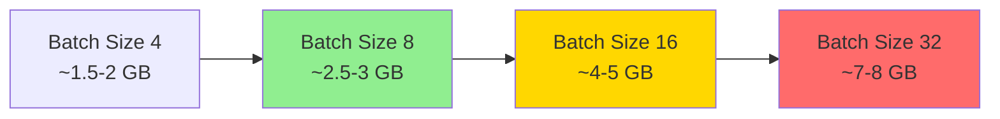

# VRAM Requirements for BdSLW_SPOTER Experiment

## Minimum VRAM Requirements

| Configuration | VRAM Needed | Recommended |
|--------------|---------------|--------------|
| **Minimum (batch=4)** | ~1.5-2 GB | 2 GB |
| **Standard (batch=8)** | ~2.5-3 GB | 4 GB |
| **Optimal (batch=16)** | ~4-5 GB | 6 GB |
| **Maximum (batch=32)** | ~7-8 GB | 8 GB |

## Detailed VRAM Breakdown

### Model Components Memory Usage

| Component | Memory (MB) | Notes |
|-----------|-------------|-------|
| **Model Weights** | ~5.2 MB | 1.3M parameters × 4 bytes (float32) |
| **Gradients** | ~5.2 MB | Same as model weights |
| **Optimizer States** | ~10.4 MB | AdamW stores 2x model weights |
| **Input Tensors** | ~0.5-2 MB | Depends on batch size and sequence length |
| **Activations** | ~10-40 MB | Forward pass intermediate results |
| **Backward Pass** | ~10-40 MB | Gradient computation |
| **Total (batch=8)** | ~31-98 MB | Actual usage varies by sequence length |

### Batch Size Impact



## VRAM Usage by Phase

### Phase 3 (Model Implementation)
- **VRAM**: ~2-3 GB
- **Usage**: Model initialization, forward pass testing
- **Batch size**: 4-8 samples

### Phase 4 (Training)
- **VRAM**: ~4-6 GB recommended
- **Usage**: Full training with backpropagation
- **Batch size**: 8-16 samples (as configured in Phase 4)
- **Peak memory**: During backward pass

### Phase 5 (Evaluation)
- **VRAM**: ~2-3 GB
- **Usage**: Inference only (no gradients)
- **Batch size**: 16-32 samples for evaluation

## Memory Optimization Techniques Used

1. **Gradient Accumulation** (Phase 4, Cell 7)
   - Accumulates gradients over 2 steps
   - Effective batch size = 16 with actual batch = 8
   - Reduces peak VRAM usage

2. **Attention Masking**
   - Prevents computing attention for padding tokens
   - Reduces memory for variable-length sequences

3. **Mixed Precision** (Optional)
   - Can reduce memory by ~50%
   - Use `torch.cuda.amp` if VRAM limited

## GPU Recommendations

| GPU Model | VRAM | Suitability |
|-----------|--------|-------------|
| **GTX 1050 Ti** | 4 GB | ✅ Minimum viable (batch=8) |
| **GTX 1650** | 4 GB | ✅ Standard configuration |
| **RTX 3060** | 12 GB | ✅ Excellent (batch=32) |
| **RTX 3070** | 8 GB | ✅ Good (batch=16-24) |
| **RTX 3080** | 10 GB | ✅ Excellent (batch=32) |
| **A100** | 40 GB | ✅ Overkill but perfect |

## Practical Recommendations

### For Training (Phase 4)
```python
# Recommended configuration for 4 GB VRAM
batch_size = 8
gradient_accumulation_steps = 2  # Effective batch = 16
max_seq_length = 150

# For 6 GB VRAM
batch_size = 16
gradient_accumulation_steps = 2  # Effective batch = 32
max_seq_length = 150
```

### For Evaluation (Phase 5)
```python
# Larger batch sizes possible (no gradients)
batch_size = 32  # Only ~2-3 GB VRAM needed
```

## VRAM Monitoring

The notebooks include VRAM monitoring in Phase 4:

```python
# Cell 16: Performance Benchmarking
memory_allocated = torch.cuda.memory_allocated() / 1024**2  # MB
memory_reserved = torch.cuda.memory_reserved() / 1024**2    # MB
```

## Summary

- **Minimum**: 2 GB GPU (batch=4, very slow training)
- **Recommended**: 4-6 GB GPU (batch=8-16, good performance)
- **Optimal**: 8+ GB GPU (batch=32, fastest training)

The system is designed to work efficiently on consumer GPUs (4-6 GB VRAM) through gradient accumulation and memory-efficient attention mechanisms.
